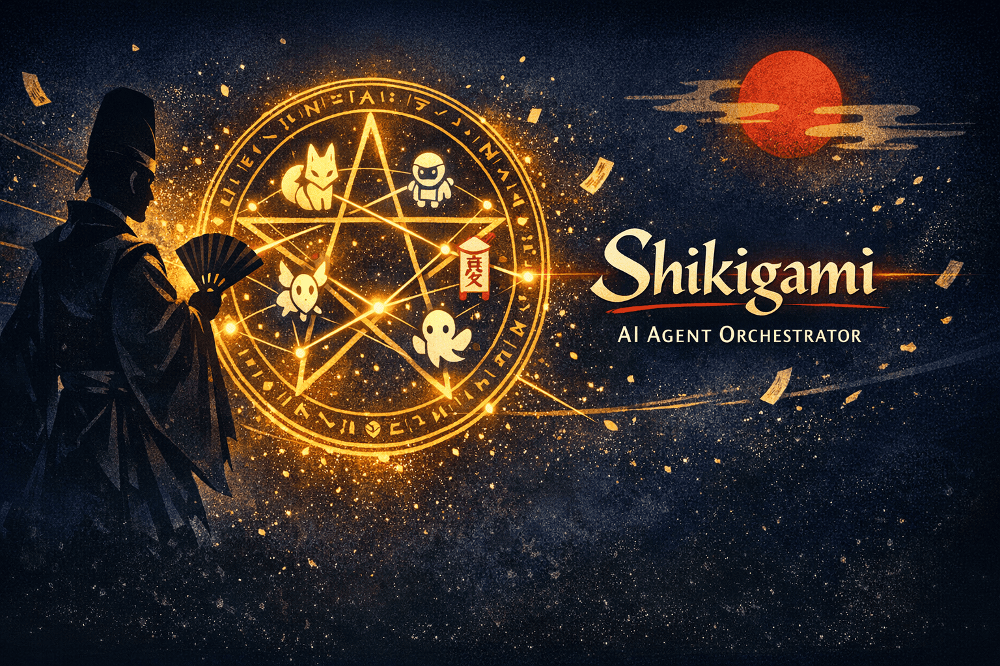

# Shikigami

  

  <a href='./README.md'>English</a> | 日本語

ソフトウェア開発特化型のオンデマンド型AIエージェントオーケストレーター

## これは何？　

Shikigami[^1] は AI を活用してソフトウェア開発を効率化するためのツールです。

[^1]: 式神とは古代日本の官職である陰陽師が術で生成する霊的なロボットのこと。オンデマンドで生成される個々のAIエージェントを式神に見立て、術者（ユーザー）の意図を込めて作り使役されるという関係性に着目して命名。

- 目的を達成するための主な手段として AI エージェントのオーケストレーションを利用しています
- ユーザーはオーケストレーターロールのAIエージェントとだけインタラクションし、要求を伝えるとオーケストレーターが要件分析をはじめます
- 要件が確定すると、その要件を実現するために適した AI エージェントのチーム（タスクフォース）を生成します
- この後の工程はタスクフォースにより自律的に行われます

## ターゲットユーザー

- ユーザーはソフトウェア開発者であることを想定しています
  - 実装の詳細よりも、アーキテクチャ設計や意思決定に集中したいソフトウェア開発者向けです
- Shikigami では、要件定義が済むまではオーケストレーターが利用者にヒアリングを行うため、これに回答できる必要があります
  - ユーザーは開発したいソフトウェアに関するドメイン知識を保有している必要があります
  - ユーザーは技術的な質問（DB選定、FW指定など）に対して明確な意思決定を下すことが求められます

## 設計

- [ユビキタス言語一覧](./docs/glossary.ja.md)
- [オーケストレーションの目的](./docs/purpose-of-orchestration.ja.md)
